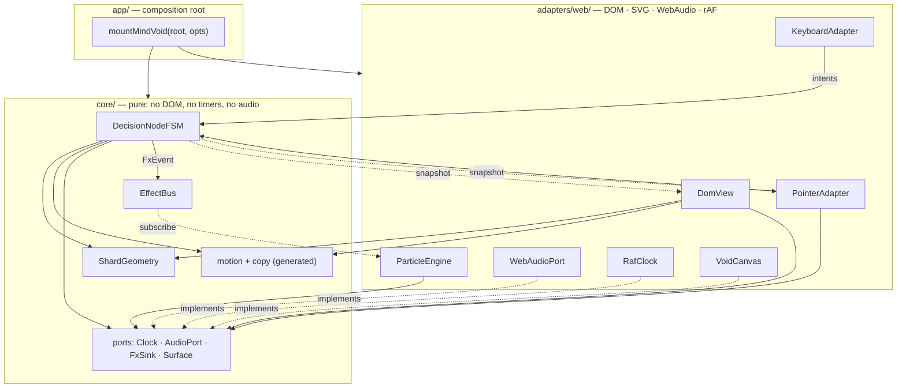
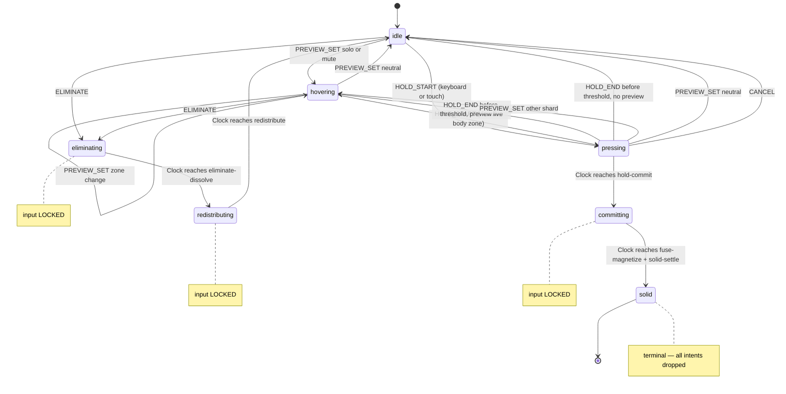

# Architecture Spine — Mind Void

## Design Paradigm

**Hexagonal (ports and adapters) around a pure core, with unidirectional snapshot rendering.**

The decision logic is a platform-agnostic core that receives device-neutral intents and emits immutable snapshots. Every Web API — DOM, SVG, pointer events, WebAudio, `requestAnimationFrame` — lives in an adapter ring around it. Rendering is one-way: snapshot in, DOM attributes and CSS custom properties out, nothing read back.

| Layer | Directory | Contains |
| --- | --- | --- |
| Core | `src/core/` | `DecisionNodeFSM`, `ShardGeometry`, `EffectBus`, intents, snapshot, generated motion profiles and copy, port interfaces |
| Adapter ring | `src/adapters/web/` | `PointerAdapter`, `KeyboardAdapter`, `DomView`, `ParticleEngine`, `WebAudioPort`, `RafClock`, `VoidCanvas` |
| Composition root | `src/app/` | `mountMindVoid` — the only wiring site |

The addendum's layer chain is this paradigm's read: `InputAdapter → DecisionNodeFSM → DomView`, with FX branching through `EffectBus → ParticleEngine`. `InputAdapter` is a **role**, not a module: `PointerAdapter` and `KeyboardAdapter` are its two web implementations, which is why the architecture-credit string the UI displays stays accurate.

## Invariants & Rules



### AD-1 — Pure core, one-way dependency

- **Binds:** all
- **Prevents:** Web APIs leaking into decision logic, which would make the core untestable and block the mobile adapter swap the PRD reserves (§2.1)
- **Rule:** `src/core/` imports nothing outside `src/core/` and references no `document`, `window`, timer, or audio API. Adapters may import core; core may never import an adapter. No adapter imports another adapter — adapters communicate only through intents, the snapshot, and the ports, including the `Surface` port (AD-21) that gives them the layers and the coordinate transform they would otherwise reach into a sibling for. Only `src/app/` may import both rings.

### AD-2 — The FSM is the sole owner of interaction state

- **Binds:** all
- **Prevents:** a second store — framework state, adapter-local flags, or DOM attributes read back — diverging from the FSM
- **Rule:** phase, shard set, focus, preview mode, and committed winner exist only inside `DecisionNodeFSM`. Every other layer receives them as a readonly `DecisionNodeSnapshot`. DOM attributes and CSS custom properties are output only and are never read as state. Pointer coordinates are the one exception and are explicitly *not* state: they are never stored in the snapshot, and the live cursor position is written straight to the DOM by the pointer adapter (AD-10).

### AD-3 — One input-lock gate, inside the FSM

- **Binds:** FSM, both adapters
- **Prevents:** two gates encoding one rule and drifting apart
- **Rule:** the locked phases are `eliminating`, `redistributing`, `committing`; `solid` is terminal. While locked the FSM drops every intent, `CANCEL` included. Adapters dispatch unconditionally, must not gate dispatch on phase, and must not expose an `acceptingInput`-style predicate.

### AD-4 — Device-neutral intents; position is an FX hint only

- **Binds:** FSM, both adapters
- **Prevents:** a keyboard code path running parallel to the pointer path, and positional data silently steering a transition
- **Rule:** the intent set is exactly `FOCUS_SET`, `PREVIEW_SET`, `HOLD_START`, `HOLD_END`, `ELIMINATE`, `CANCEL`. No intent name may reference a device. `shardId` is the only field a transition may read; `at?: { x, y }` is an optional FX-origin hint that falls back to the `ShardGeometry` centroid when absent. There is no `COMMIT` intent — Commit is never something an adapter asserts, it is what the Clock concludes from a completed hold (AD-5), so no input path can shortcut the 400ms. An intent needing a device-specific field to work is a design error, not a new field.

### AD-5 — The FSM owns the clock; durations have one source

- **Binds:** FSM, DomView, motion module
- **Prevents:** CSS and the FSM each owning a duration, so the input lock opens while the shape is still moving
- **Rule:** the FSM reads durations from an injected `MotionProfile` and advances out of a timed phase on an injected `Clock` — never on a DOM event, never on a literal. DomView consumes the identical values as CSS custom properties on the mount root. `prefers-reduced-motion` selects a different `MotionProfile` at mount; the phase graph is unchanged and a `0ms` phase passes through in one tick. The profile carries three non-duration switches too — idle pulse, ambient drift, and settle overshoot — so reduced motion disables them by data rather than by a branch. Reduced motion may compress a duration to zero but may **never** suppress the `seam-flash` FX event or a required audio cue: the hero beat stays marked even when it stops being cinematic. Not every motion token is a phase duration — `preview-in`, `preview-out`, and `pulse-idle` are CSS-only transition values and must not become phases.

### AD-6 — `ShardGeometry` is the single geometry owner

- **Binds:** DomView, hit-testing, FSM, ParticleEngine
- **Prevents:** four consumers deriving shard polygons independently
- **Rule:** a pure `ShardGeometry` module maps `(shardCount, nodeRadius, seamConfig)` to polygons, centroids, unit outward normals, and the rim-band inset path, covering both the binary single-seam layout and the radial 3–5 layout. No other module computes shard geometry or recovers it from the DOM via `getBBox` or `getBoundingClientRect`. Only `VoidCanvas` calls `getBoundingClientRect`, only on its own root, and only to convert client space to canvas-local space; the cached rect is invalidated by `ResizeObserver` on the root, by passive `scroll` and `resize` listeners on the window, and unconditionally at the start of each gesture — `ResizeObserver` alone is not enough, because it observes size and never fires on scroll.

### AD-7 — Hit zones are DOM elements, not code branches

- **Binds:** DomView, PointerAdapter
- **Prevents:** rim-versus-body precedence being implemented one way in rendering and another way in hit-testing
- **Rule:** DomView renders two SVG paths per shard from `ShardGeometry` — a body path and a rim-band path — with the rim above the body, each carrying its shard id and zone as data attributes. Zone resolution is the browser's own hit test on `event.target`; the pointer adapter performs no distance or point-in-polygon arithmetic. Zones exist only in the pointer adapter: the core knows preview *modes* (`solo` = commit-oriented, `mute` = eliminate-oriented) and never zones. The FX canvas keeps `pointer-events: none` and is never hit-tested.

### AD-8 — Focus and preview are separate state

- **Binds:** FSM, DomView, both adapters
- **Prevents:** the keyboard path inheriting the Solo treatment, so the focus ring reads as a commit hint — which the UX spine bans outright
- **Rule:** the snapshot carries `focusedShardId` (persistent, keyboard-set), `previewShardId` + `previewMode` (transient, pointer-set), and `pressedShardId` (set on `HOLD_START` from either device) as three independent fields. Pointer input never sets focus; keyboard input never sets preview. DomView renders the focus ring from the first field, the Solo/Mute treatment from the second, and the perimeter hold progress from the third — so one progress indicator serves both input paths and neither adapter has to guess which field holds the pressed shard.

### AD-9 — Lossy FX channel, lossless required channels

- **Binds:** FSM, EffectBus, ParticleEngine, audio, cursor
- **Prevents:** a cue that PRD FR-8 makes mandatory being dropped by the bounded bus under interaction spam, and ambient atmosphere evicting real effects from a capacity-4 queue
- **Rule:** the `EffectBus` carries **particle garnish only** — it is bounded at capacity 4, drops oldest, and publishes exactly three FSM-originated event types in v1 (`shard-eliminate`, `shard-commit`, `seam-flash`), each meaning "spawn a burst here", never "this beat happened". Every beat those bursts decorate is *also* rendered losslessly elsewhere: the shard dissolve, the seam brighten, the magnetize, and the `cut-flash` are CSS states on DOM elements driven by the snapshot, and the audio release goes through the `AudioPort`. So a dropped bus event costs particles and nothing else — no state, no required channel, and no beat that FR-4, FR-5, FR-8, or SM-2 depends on. Ambient sparks are generated inside `ParticleEngine` by its own emitter and never touch the bus, so atmosphere cannot evict a burst from a queue of four.

### AD-10 — Cursor is DomView-owned and scoped to the mount root

- **Binds:** DomView, both adapters
- **Prevents:** adapter and view both deciding what the cursor *means*, and an embedded instance leaking cursor state into its host page
- **Rule:** the attract/repulse cursor is a DOM element inside the mount root, not a CSS `cursor` value — the UX specifies rings, a dot, and tick direction, which no native cursor keyword can express, so the surface sets `cursor: none` and draws its own. Its **mode** is a data attribute written on the mount root by DomView from the snapshot alone; its **position** is written to the element's transform by the pointer adapter directly, because position is not state (AD-2) and must not cost a snapshot per pointer move. No other writer touches either. Nothing is written to `document.body` or `:root`.

### AD-11 — Audio port surface and the autoplay gate

- **Binds:** WebAudioPort, FSM, app
- **Prevents:** the bed being started from two places; a phase depending on whether audio is audible; and the required FR-8 channel dying permanently because the first attempt landed before the browser granted user activation
- **Rule:** `AudioPort` exposes exactly `bed-start`, `bed-stop-release`, `preview(mode, shardIndex)`, `eliminate-cut`, `commit-chord`. The FSM emits `bed-start` on the first **activating** intent — `HOLD_START` or `ELIMINATE`, which originate from a pointerdown or keydown — and never from a `PREVIEW_SET`, because a hover grants no user activation and `AudioContext.resume()` would be refused. The context is created lazily and resumed inside the port, never by the FSM; while it remains suspended the port re-attempts resume on every subsequent cue rather than latching a permanent no-op, and it never shows anything. The FSM never learns whether audio is audible, so no phase and no lock depends on it. Cues are synthesised from oscillators and filters; the build ships no audio assets, which is also what lets `preview` pitch follow `shardIndex`.

### AD-12 — Eliminate floors at two shards

- **Binds:** FSM, DomView, both adapters
- **Prevents:** the eliminate path consuming the DeferReveal hero beat that SM-2 measures, and a dead click on an inert rim
- **Rule:** while shard count is 2 the FSM refuses `ELIMINATE` and coerces `previewMode: mute` to `neutral`, so the rim offers no highlight, no repulse cursor, and no `eliminate-cut`. Commit becomes the only exit. The floor is enforced in the FSM so both adapters inherit it; no adapter implements it. The coercion applies to preview only and must never reach a hold: during `pressing`, a `PREVIEW_SET` naming the **pressed shard** is ignored whatever its zone, so a two-pixel drift from body onto rim cannot cancel the hero commit (AD-17).

### AD-13 — Focus survives destructive transitions

- **Binds:** FSM, DomView
- **Prevents:** focus landing on nothing after an Eliminate, stranding a keyboard user mid-demo
- **Rule:** when the eliminated shard held focus, the FSM moves `focusedShardId` to the survivor at the same index, clamped to last; it never becomes null while a shard exists. DomView keys shard elements by shard id so redistribute reuses nodes instead of recreating them, and re-applies DOM focus after `redistributing` completes.

### AD-14 — The composition root is the only wiring site

- **Binds:** all
- **Prevents:** layers constructing their own collaborators, which blocks test doubles and makes the demo un-embeddable
- **Rule:** `mountMindVoid(root, opts)` in `src/app/` is the only place that constructs the FSM, geometry, surface, view, adapters, bus, particle engine, clock, audio port, motion profile, and copy. No module reaches for a collaborator through an import-time singleton, and no module assumes the canvas equals the viewport. `opts` is the whole configuration surface and is exactly `{ shards?, shardCount?, motion?: 'auto' | 'full' | 'reduced', audio?: boolean, seed?: number }`; anything not listed is a token (AD-16) or is derived, and `nodeRadius` in particular is derived from the surface size and is never an option. `mountMindVoid` returns an unmount handle that detaches every listener, cancels the rAF loop, clears the bus, stops audio, and invalidates the clock so no pending callback can fire against a torn-down tree.

### AD-15 — Keyboard hold semantics

- **Binds:** KeyboardAdapter, FSM
- **Prevents:** auto-repeat firing a stream of `HOLD_START`, and a hold stuck open when the window loses focus
- **Rule:** the adapter ignores `event.repeat`, sends `HOLD_START` on the first `Enter`/`Space` keydown and `HOLD_END` on keyup, calls `preventDefault` on `Space` to suppress scrolling, and sends `CANCEL` on `blur` and `visibilitychange`. `Delete`/`Backspace` sends `ELIMINATE`. Any keydown carrying a modifier is ignored. `ELIMINATE` is refused while the phase is `pressing`, so a delete key cannot pre-empt a commit in progress.

### AD-16 — Design tokens have one generated source

- **Binds:** DomView, stylesheets, motion module
- **Prevents:** hex and duration literals scattered across CSS and TypeScript drifting from the frozen token set
- **Rule:** `DESIGN.md` frontmatter is the authority. One generated artifact per consumer — CSS custom properties for paint, a TypeScript `MotionProfile` for timing — both derived from it by `scripts/gen-tokens.ts`. No colour, duration, or spacing literal appears anywhere else in the source. Reduced motion is a second generated profile, not overridden CSS.

### AD-17 — Preview is re-synced after every geometry change

- **Binds:** PointerAdapter, FSM
- **Prevents:** a stationary pointer silently losing its Solo/Mute preview once redistribute moves the geometry beneath it
- **Rule:** on leaving a locked phase, and on host resize or scroll, the pointer adapter re-hit-tests its cached last client position and dispatches a fresh `PREVIEW_SET` — `neutral` included. The dispatch is deferred to a microtask, never issued synchronously from inside the snapshot callback that detected the edge, so it does not violate the re-entrancy rule (AD-24). Adapters may observe the snapshot to detect this edge but still may not gate dispatch on phase (AD-3).

### AD-18 — The FSM has no per-frame role

- **Binds:** FSM, DomView, ParticleEngine
- **Prevents:** continuous animation being driven from the state machine, which would put the frame budget SM-3 sets at the mercy of dispatch cost
- **Rule:** the FSM emits a snapshot only on a transition; it never ticks per frame. All continuous motion is owned outside it — idle pulse, rim reveal, shard redistribution, and hold-progress fill are CSS transitions on the DomView's `data-*` state, ambient drift and particles are `ParticleEngine`. `ParticleEngine` runs the **only** `requestAnimationFrame` loop in the product and sheds particles rather than frames: live particles are capped at 400 and a burst's count scales with `intensity` within that cap. DomView writes attributes and custom properties in one pass per snapshot and never reads layout, so a state change cannot force a reflow.

### AD-19 — Touch degrades by losing preview, not by growing a path

- **Binds:** PointerAdapter, DomView
- **Prevents:** a touch visitor hitting an interaction that assumes hover, and a second tap-handling path growing beside the pointer path
- **Rule:** the discriminator is `event.pointerType` on each event, never the `pointer: coarse` media query — that query is documented as unreliable across iOS, Android, ChromeOS, and Windows, so an iPad with a trackpad would otherwise lose preview it can perfectly well render. A `touch` pointer emits no `PREVIEW_SET`, so `hovering` is simply never entered and `pressing` follows `idle`; the same events, the same intents, and the same 400ms hold otherwise apply per AD-23. The custom cursor is hidden for touch, so the visual zone treatment carries the distinction alone. No coarse-only intent, phase, or FX exists.

### AD-20 — Microcopy is generated state, owned by DomView

- **Binds:** DomView, copy module, app
- **Prevents:** the hint-and-thesis sequence being reinvented as an ad-hoc `setTimeout` in whichever module noticed the gap, and drifting from the UX's fixed strings
- **Rule:** the product's three strings are generated into one copy module from the UX fixed-strings table; no string literal appears in a component. DomView owns their lifecycle, derived from the snapshot plus the same injected `Clock`: the hint shows until the first entry into `solid`, then the thesis replaces it for a `thesis-hold` duration carried in the `MotionProfile`, then both fade permanently. This is display state, so it lives in DomView and never enters the FSM snapshot — the FSM has no concept of copy.

### AD-21 — The host surface is a port, not a sibling adapter

- **Binds:** all adapters, app
- **Prevents:** `PointerAdapter` importing `VoidCanvas` for its coordinate transform and `DomView` importing it for its SVG layer — which AD-1 forbids, leaving no legal answer at all
- **Rule:** `Surface` is a core port exposing the layer handles, the canvas size and device pixel ratio, and `clientToLocal(clientX, clientY)`. `VoidCanvas` is its single web implementation, constructed by the composition root and injected into every adapter that needs the surface. No adapter reaches for another adapter to obtain geometry, layers, or a transform.

### AD-22 — Canonical geometry, transform placement, one coordinate origin

- **Binds:** ShardGeometry, DomView, ParticleEngine, FSM
- **Prevents:** two irreconcilable failures — a redistribute animation with no legal mechanism, since SVG `points` is not CSS-animatable and AD-18 leaves no second rAF loop; and FX bursts landing offset by the node-centre vector because one module reads a coordinate as node-local and another as canvas-local
- **Rule:** `ShardGeometry` emits each shard's polygon in **node-local** coordinates around a canonical origin, plus the transform that places it. DomView renders one SVG group per shard and positions it by CSS `transform`, so redistribution is a transform transition over `redistribute` with no per-frame work and no points rewrite; when a shard count change also changes layout family — radial to binary seam — the points swap happens under a brief opacity cross-fade while the transform animates. Node-local coordinates never leave that render output: **every coordinate crossing a module boundary is canvas-local, top-left origin, CSS pixels**, and that includes centroids, outward normals, the `at` FX hint, and everything on the `EffectBus`.

### AD-23 — The input event mapping is fixed, and gestures are held

- **Binds:** PointerAdapter, KeyboardAdapter, DomView
- **Prevents:** a rim press being read as the start of a hold so the eliminate that follows arrives in `pressing` and gets refused — making FR-6 unreachable by pointer — and a touch hold losing its `pointerup` to browser panning, which strands the FSM in `pressing` or lets it reach a spurious Commit
- **Rule:** the mapping is exactly this and nothing infers a second one: `pointerdown` on a **body** path sends `HOLD_START`; `pointerdown` on a **rim** path sends `ELIMINATE`; `pointerup` sends `HOLD_END`; `pointermove` sends `PREVIEW_SET`; `pointercancel` and `lostpointercapture` send `CANCEL`. There is no `click` listener anywhere, so no press-then-click race exists. On `pointerdown` the adapter calls `setPointerCapture`, and the shard layer sets `touch-action: none`, so a drifting finger cannot have the gesture stolen by panning.

### AD-24 — Emission order and re-entrancy are fixed

- **Binds:** FSM and every subscriber
- **Prevents:** two stories disagreeing on whether DomView sees a phase change before or after the particles spawn and the audio fires, and a subscriber dispatching back into a half-finished transition
- **Rule:** a transition completes fully in the FSM, then notifies in one fixed order: **snapshot subscribers first, then `AudioPort`, then `EffectBus`** — the state and its lossless rendering land before any garnish. Subscribers are notified in subscription order, and the composition root subscribes DomView first. A subscriber must not dispatch synchronously from inside a callback; a re-entrant dispatch is deferred to a microtask (AD-17). A `Clock` callback that arrives after unmount is dropped by the clock, not guarded for by each subscriber.

### AD-25 — Focusable geometry carries its own semantics

- **Binds:** DomView, KeyboardAdapter
- **Prevents:** the keyboard floor the UX adopted existing in event handlers but not in the accessibility tree, so `Tab` order depends on whatever DOM order the render happened to produce
- **Rule:** each shard body path is the single focusable element for its shard — `tabindex="0"`, an explicit accessible name from the generated copy, and a role that describes choosing an option. The rim path, the FX canvas, and the ambient field are never focusable and are hidden from assistive technology. DOM order of shard groups follows shard index, so `Tab` order is the shard order rather than a render artefact, and AD-13's focus restoration targets that same element.

### State chart and lock windows



| Phase | Duration source | Full profile | Reduced profile | Intents accepted |
| --- | --- | --- | --- | --- |
| `idle` | — | — | — | `FOCUS_SET`, `PREVIEW_SET`, `HOLD_START`, `ELIMINATE` |
| `hovering` | — | — | — | `FOCUS_SET`, `PREVIEW_SET`, `HOLD_START`, `ELIMINATE`, `CANCEL` |
| `pressing` | `hold-commit` to threshold | 400ms | 400ms | `HOLD_END`, `PREVIEW_SET`, `CANCEL` |
| `eliminating` | `eliminate-dissolve` | 220ms | 120ms | none — locked |
| `redistributing` | `redistribute` | 300ms | 0ms | none — locked |
| `committing` | `fuse-magnetize` + `solid-settle` | 580ms | 120ms | none — locked |
| `solid` | — | terminal | terminal | none |

`seam-flash` is an FX event scheduled on the same injected `Clock` at `fuse-magnetize` elapsed within `committing`; it is a milestone, not a phase. `dragging` from the sketch is not a v1 phase (see Deferred).

Leaving `pressing` early is guarded on whether a preview is live, which is what lets one chart serve all three input paths: a mouse release in place returns to `hovering`, because the preview under the pointer is still true, while a keyboard or touch release returns to `idle`, because neither ever set one. A release *after* leaving the shard arrives as `PREVIEW_SET neutral` and also lands in `idle`. Every one of them rewinds the progress stroke over `preview-out`, a CSS value rather than a phase.

## Consistency Conventions

| Concern | Convention |
| --- | --- |
| Naming — types | Core types `PascalCase`; intents `SCREAMING_SNAKE`; phases lowercase; FX event types kebab-case (`shard-eliminate`); audio cue types kebab-case (`commit-chord`) |
| Naming — files & DOM | Files kebab-case; DOM state attributes `data-*` kebab-case (`data-phase`, `data-preview`, `data-zone`, `data-cursor`); CSS custom properties prefixed `--mv-`; generated files carry `.generated.` in the filename and are never hand-edited |
| Data & formats | Ids are opaque strings (`node-1`, `shard-a`) and never carry position or index meaning; all coordinates are numbers in VoidCanvas local CSS pixels; all durations are integer milliseconds. No dates, no serialisation format, no error envelope — the demo performs no I/O |
| State mutation | Only `DecisionNodeFSM.dispatch(intent)` mutates state. Snapshots are readonly and are replaced, never edited. Subscribers must not dispatch synchronously from inside a snapshot callback |
| Errors | Construction throws outside a shard count of 2–5 — below 2 there is nothing to decide, above 5 the cracked read collapses. At runtime a port failure is swallowed by the port itself and must never break the render loop or leave a phase locked; the injected `Clock` is the only thing that unlocks a phase |
| Config & logging | Configuration arrives only as `mountMindVoid` options — no environment variables, no globals, no query-string flags. No logging in the production build |
| Testing | Vitest against the pure core only — `DecisionNodeFSM`, `ShardGeometry`, `EffectBus` — driven by an injected fake `Clock`, with a test per transition and per input-lock window. Adapter-ring rules are enforced by review against the ADs rather than by tests; that is an accepted v1 risk, not an oversight, and it is what the DOM-testing entry under Deferred would buy back |

## Stack

Verified against the live registries on 2026-07-25.

| Name | Version |
| --- | --- |
| TypeScript | 7.0.2 |
| Vite | 8.1.5 |
| Vitest | 4.1.10 |
| Node.js (build only) | 20.19+ / 22.12+ |
| UI framework | none |
| Runtime dependencies | none |

TypeScript 7.0 ships without the programmatic compiler API until 7.1, and `typescript-eslint` still declares a `typescript` peer below 6.1 — so it cannot even install here, and restricting it to rules that need no type information would not help, since its parser consumes the compiler API just to read a `.ts` file. **v1 therefore ships no linter:** `tsc --noEmit` is the only static gate. Any linter added later must not consume the TypeScript compiler API, or the project takes on the `@typescript/typescript6` bridge and two compilers side by side (see Deferred).

## Structural Seed

```text
mind-void/
  index.html
  vite.config.ts
  scripts/
    gen-tokens.ts              # DESIGN.md frontmatter -> tokens + motion profiles + copy
  src/
    core/                      # pure: no DOM, no timers, no audio
      decision-node-fsm.ts
      shard-geometry.ts
      effect-bus.ts
      intents.ts
      snapshot.ts
      ports.ts                 # Clock · AudioPort · FxSink · Surface
      motion.generated.ts
      copy.generated.ts        # the product's three fixed strings
    adapters/web/
      void-canvas.ts           # Surface impl: layers + client-to-local transform
      pointer-adapter.ts
      keyboard-adapter.ts
      dom-view.ts
      particle-engine.ts
      web-audio-port.ts
      raf-clock.ts
    app/
      mount.ts                 # mountMindVoid — sole wiring site
    styles/
      tokens.generated.css
      void.css
  test/                        # core only, injected fake Clock
    decision-node-fsm.test.ts
    shard-geometry.test.ts
    effect-bus.test.ts
```

**Operational envelope.** A static site, built by `vite build` into a deployable folder. No server, no backend, no datastore, no persistence, no accounts, no analytics, no error reporting, no service worker. One environment: the built artifact is identical wherever it is hosted, so there is no environment-specific configuration to diverge. The public entry is `mountMindVoid(root, opts)` returning an unmount handle, which lets any portfolio shell embed the demo without a rewrite; the standalone `index.html` is one caller of that same entry, not a privileged path.

**Rendering layers**, bottom to top, all sized to the mount root rather than the viewport: vignette background, SVG shard layer (body path + rim path per shard, the only hit-tested layer), FX canvas at `pointer-events: none` carrying both particles and the ambient field, and the text layer carrying the hint, thesis, and architecture credit. **This list is closed** — the UX bans tooltips, coach marks, onboarding overlays, and confirmation dialogs, so there is no overlay or portal layer to render one into.

## Capability → Architecture Map

| Capability | Lives in | Governed by |
| --- | --- | --- |
| FR-1 Present VoidCanvas, idle pulse | `adapters/web/void-canvas.ts`, `app/mount.ts` | AD-1, AD-14, AD-16, AD-18, AD-21 |
| FR-2 Apply Emerald theme | `styles/tokens.generated.css`, `scripts/gen-tokens.ts` | AD-16 |
| FR-3 Render DecisionNode shards (binary + 3–5) | `core/shard-geometry.ts`, `adapters/web/dom-view.ts` | AD-6, AD-7, AD-22 |
| FR-4 Zone Solo preview | `pointer-adapter.ts` → FSM → `dom-view.ts` | AD-4, AD-7, AD-8, AD-10, AD-23 |
| FR-5 Zone Mute preview | rim path in `dom-view.ts` → FSM | AD-7, AD-10, AD-12, AD-23 |
| FR-6 Eliminate a Shard | FSM `eliminating` + `redistributing` | AD-3, AD-5, AD-9, AD-12, AD-13, AD-22, AD-23 |
| FR-7 Commit a winner | FSM `pressing` → `committing` → `solid` | AD-3, AD-4, AD-5, AD-15, AD-23 |
| FR-8 Multi-sensory tension and release | `web-audio-port.ts`, cursor in `dom-view.ts` | AD-9, AD-10, AD-11, AD-24 |
| FR-9 Bounded EffectBus, frame budget | `core/effect-bus.ts`, `particle-engine.ts` | AD-7, AD-9, AD-18, AD-22 |
| Keyboard floor (UX) | `adapters/web/keyboard-adapter.ts` | AD-4, AD-8, AD-13, AD-15, AD-25 |
| Reduced motion (UX) | generated reduced `MotionProfile` | AD-5, AD-16, AD-18 |
| Touch degradation floor (UX) | `pointer-adapter.ts` | AD-4, AD-19, AD-23 |
| Hint, thesis, architecture credit (UX) | `core/copy.generated.ts`, `dom-view.ts` | AD-16, AD-20 |
| Ambient field (UX) | `particle-engine.ts` internal emitter | AD-9, AD-18 |

## Deferred

- **`dragging` phase and the sketch's drag verbs** (drag-out-to-eliminate at 56px, drag-overlap-to-commit). The UX spine adopted neither and bans drag-to-reorder; revisit only if a future spine adds a drag verb.
- **Noise and Promise ChargeNode skins.** The core is generic over shard count but not over node kind; the kind abstraction is deferred until a second kind actually ships.
- **Multiple concurrent DecisionNodes.** `VoidCanvas` and `EffectBus` are already node-count-agnostic, but v1 seeds exactly one, so multi-node layout, focus order across nodes, and per-node FX budgets stay undecided.
- **Mobile InputAdapter and haptics.** AD-1 and AD-4 are what make the swap possible later; the adapter itself is out of scope.
- **Persistence, accounts, sync, PWA install.** No datastore decision is owed while nothing outlives a page load.
- **Undo after Eliminate.** Excluded by the PRD; would require a command log the FSM deliberately does not keep.
- **Particle backend beyond 2D canvas.** WebGL or WebGPU is a `ParticleEngine`-internal swap behind the same `FxSink` subscription; not needed for the frame budget SM-3 sets.
- **`seal-burst` FX.** Named in the sketch but belongs to the Checkpoint Seal verb, which is vision, not v1. AD-9 closes the bus event set at three, so adding it later is a deliberate amendment rather than a quiet extra.
- **Tap-to-preview for touch.** UX Open Item 2. AD-19 fixes the degradation floor; whether touch earns an intermediate preview state is a UX call, and it would add a phase, so it stays here until the demo sees real mobile traffic.
- **Linting.** v1 ships none, because no current TypeScript-aware linter installs against TypeScript 7.0.2. Revisit when `typescript-eslint` supports the 7.x peer range or when a linter that does not consume the compiler API is worth adopting; the constraint, not the tool, is what this spine fixes.
- **DOM-level and end-to-end testing, visual regression.** Core unit tests are the v1 floor; revisit if the demo grows a second surface.
- **Audio bed tuning** — pitch, preview interval, commit chord voicing. AD-11 fixes the port surface; the sound design behind it is a UX tuning pass (UX Open Item 1).
- **Shard-count ceiling above 5.** `ShardGeometry` is a function of count, so raising it is data, not architecture (UX Open Item 3).
- **i18n.** The product has three fixed strings; a message catalogue is not owed yet.
